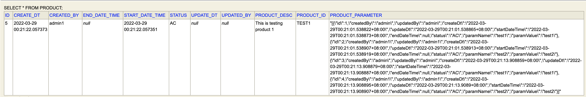

## Implement Hibernate to store JSON document into Database
To have high performance in business data, we can embed our configuration data as json into our business data as one of the column based on database json  data type

